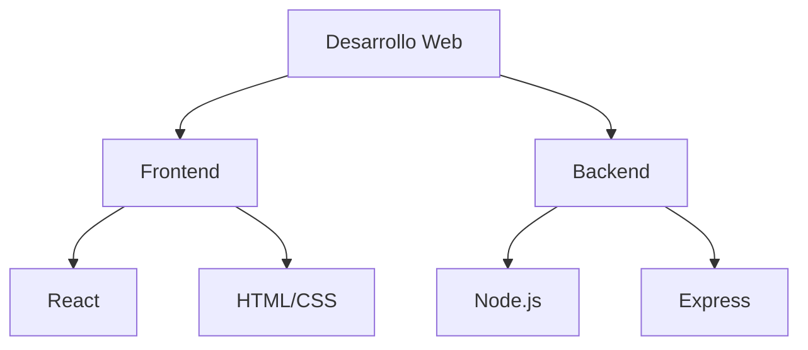

# 🚀 Matías Ozores | Técnico en Computación

<div align="center">
  
</div>

## 🌟 Sobre Mí

```javascript
const matias = {
  rol: "Técnico en Computación",
  especialidad: "Desarrollo Web",
  tecnologias: ["JavaScript", "React", "Node.js", "HTML5", "CSS3"],
  caracteristicas: ["Analítico", "Detallista", "Innovador", "Autodidacta"],
  meta: "Crear soluciones tecnológicas que impacten positivamente"
};
```

## 🛠️ Mi Stack Tecnológico

<div align="center">
  
</div>

## �� Estadísticas

<div align="center">
  
  
</div>

## 🎯 Proyectos Destacados

<table>
  <tr>
    <td align="center">
      <a href="https://matiasozores.github.io/campus-virtual-programacion/">
        
      </a>
    </td>
    <td>Plataforma educativa para el aprendizaje de programación</td>
  </tr>
</table>

## 📈 Gráfico de Actividad



## 🎮 Terminal Simulada

```bash
$ whoami
MatiasOzores

$ cat about.txt
Técnico en Computación especializado en desarrollo web.
Apasionado por crear soluciones innovadoras y eficientes.

$ ls skills/
Frontend/  Backend/  DevOps/  Database/

$ cd projects/
$ ls
campus-virtual-programacion/
```

## 📫 Conectemos

<div align="center">
  <a href="https://www.linkedin.com/in/matiasozores">
    
  </a>
  <a href="mailto:tu-email@ejemplo.com">
    
  </a>
</div>

## 🌟 Frase del Día

> "La tecnología es mejor cuando une a las personas" - Matt Mullenweg

---

<div align="center">
  
</div>

⭐️ De [MatiasOzores](https://github.com/MatiasOzores)

